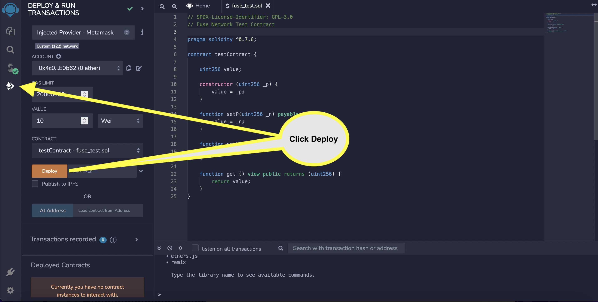

# Using Remix and Metamask

Remix is an IDE for smart contract development, including compilation, deployment, testing, and debugging.

Check out the [official documentation](https://remix-ide.readthedocs.io/en/latest/) to learn more about setting up and using Remix.

For help setting up MetaMask, please visit [the official documentation](https://metamask.zendesk.com/hc/en-us).

### Connecting Remix to Fuse via MetaMask 

Remix supports the following environments for contract deployment via Fuse:

* Javascript VM
* Injected Web3
* Web3 Provider

Using MetaMask with Remix is an example of Injected Web3, which we shall discuss shortly.

* To start, go to [https://remix-project.org/](https://remix-project.org/) and select "Start Coding online."

<figure><figcaption>
Select "Start Coding Online" option
</figcaption></figure>

<figure><figcaption>
Select "Deploy &#x26; run transactions" option
</figcaption></figure>

<figure><figcaption>
Select "Injected Provider - Metamask" option under Environment
</figcaption></figure>

<figure><figcaption>
Select the Metamask Account you want to connect. Make sure you selected Fuse Network in the Metamask Network option.
</figcaption></figure>

<figure><figcaption>
Click Connect to link your Remix IDE to Metamask with Fuse network connection.
</figcaption></figure>

<figure><figcaption>
Remix IDE is successfully connected to Metamask with Fuse Network connection.
</figcaption></figure>

### Compiling your contract in Remix 

<figure><figcaption>
Compiling a smart contract on Fuse Network
</figcaption></figure>

### Deploying your Contract 

<figure><figcaption>
Deploying your smart contract on Fuse Network
</figcaption></figure>

You can view your deployed smart contract transaction at Fuse explorers.

Fuse Mainnet Explorer is at [https://explorer.fuse.io/](https://explorer.fuse.io/)

Fuse Testnet Spark is at [https://explorer.fusespark.io/](https://explorer.fusespark.io/)
