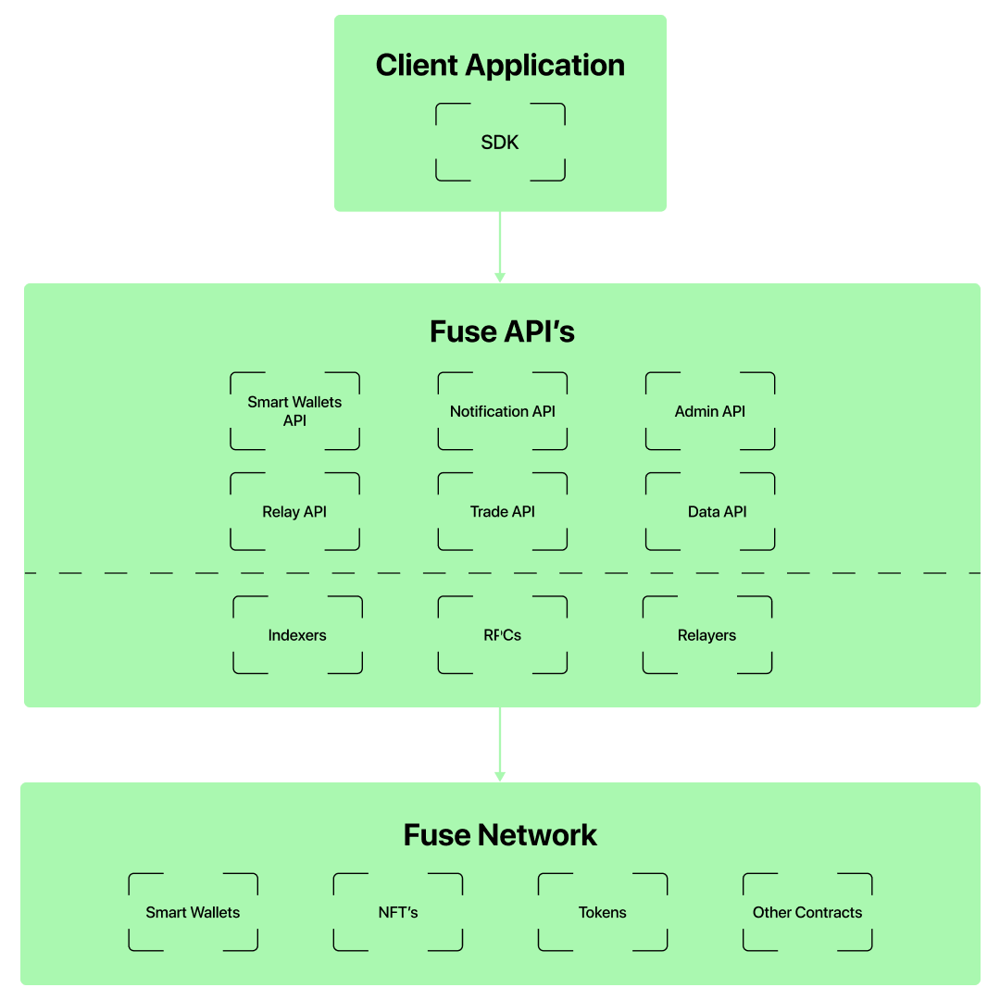

# Architecture

The Fuse Stack is comprised of several essential components, including:

* Fuse SDK enables interaction with Fuse APIs, indexing solutions, RPCs, and relayers.
* Fuse APIs, which include:
  * Smart Wallets API for creating and managing Smart Contract Wallets.
  * Relaying API for facilitating gasless transactions.
  * Admin API for automating tasks like rewards and airdropping.
  * Notifications API for subscribing to updates about wallet activity.
  * Trade API for fetching trade data and assisting with swaps.
  * Payment Link API for creating payment links.
  * DATA APIs enable additional indexed data such as balances, transaction histories, and more.
* Indexers, including subgraphs and the explorer.
* Fuse Network serves as the underlying infrastructure for the Fuse Stack.
* Smart Wallet Contracts and their modules.
* Token contracts, including ERC20 tokens and ERC721 (NFTs).
* Token factories for creating new tokens.
* Other smart contracts include AMMs of DEXes, DAO contracts, and more.

These components comprise the robust and comprehensive Fuse Stack, providing a powerful toolkit for building and deploying blockchain-based applications on the Fuse Network.
