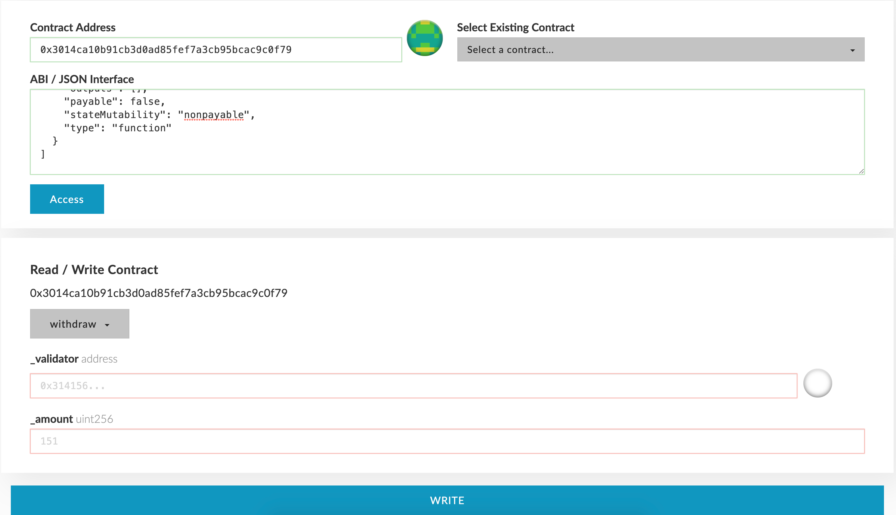

The essential requirement to become a Fuse chain validator is having a stake of at least 100,000 tokens.

The stake amount is the sum of the address's staked and delegated Fuse tokens. This guide walks through the process of using MEW (MyEtherWallet.com) in the Fuse network Roadmap - Those functionalities will be built into our Studio and will not require any technical knowledge in the future.

## Stake

There are two options to stake (both should be called from the address which would be the validator)

1. Send Fuse tokens to the consensus contract - 0x3014ca10b91cb3D0AD85fEf7A3Cb95BCAc9c0f79 on the Fuse Network.
2. Call the `stake` function on the consensus contract - 0x3014ca10b91cb3D0AD85fEf7A3Cb95BCAc9c0f79 on the Fuse Network.

## Delegate

Fuse token holders who don't want to run a node alone but still wish to participate in governing the network can delegate any amount to one of the validators. Delegating is done by calling the `delegate` function on the consensus contract with the validator address as data (see the screenshot from MEW).

_delegate_

## Withdraw

Both stakers and validators can withdraw their Fuse tokens, up to the staked/delegated amount, at any time. The withdrawn amount will be deducted from the validator stake amount. If the stake amount falls below the minimum, the validator will be removed from the Fuse chain validators list. There are two options to withdraw:

1. Call the `withdraw` function on the consensus contract with one parameter - the amount to withdraw. This call is for stakers and will reduce the stake amount of the sender address.
2. Call the `withdraw` function on the consensus contract with two parameters - validator address and amount to withdraw. This call is for both stakers (who can use their address as the parameter) and for delegators to withdraw their delegated stake on a specific validator.

_withdraw option no. 1_

_withdraw option no. 2_
